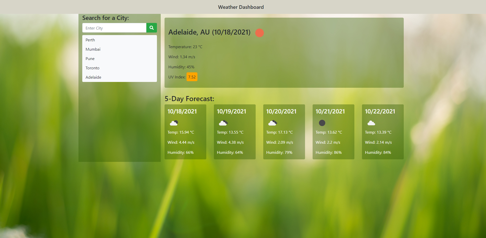

# Unit 06 Server-Side APIs Homework: Weather Dashboard

This is my 6th week in the coding bootcamp. In this week, I've learned the server side API integration. For this project, I've developed a weather dashboard application that will run in the browser and feature dynamically updated HTML and CSS. Users can search for a city, and if found the app will return the current weather, as well as a forecast of the next 5 days. The user's search history is saved as a button for them to quickly check the weather of that city again.

I was presented with the following acceptance criteria:

## Acceptance Criteria

```
GIVEN a weather dashboard with form inputs
WHEN I search for a city
THEN I am presented with current and future conditions for that city and that city is added to the search history
WHEN I view current weather conditions for that city
THEN I am presented with the city name, the date, an icon representation of weather conditions, the temperature, the humidity, the wind speed, and the UV index
WHEN I view the UV index
THEN I am presented with a color that indicates whether the conditions are favorable, moderate, or severe
WHEN I view future weather conditions for that city
THEN I am presented with a 5-day forecast that displays the date, an icon representation of weather conditions, the temperature, the wind speed, and the humidity
WHEN I click on a city in the search history
THEN I am again presented with current and future conditions for that city

```

## 💡 Development Approach

My approach was simple - to complete smaller tasks first and then bind it all together. Firstly, I've figured out various steps/tasks involved this project as mentioned below:
1. Capture the city name by providing the option of user input
2. Send the request to the Openweather server and retrieve the current weather and forecast for the captured city
3. Show the information on screen
4. Save the city names to localstorage
5. Create a button that does the same thing as steps 2 and 3 for the weather in that city again

## 💡 Design Approach

To begin with I developed the basic skeleton using html/css. Then I worked on the javascript functionality. 
Once I was happy with the desired result then I took up the css to enhance the design. The application uses Bootstrap with some of the custom styling and it is fully responsible.

## Mock-up

Please find below the application screenshot:



## 🔗 Project Link

https://ajaykulkarni01.github.io/Code-Quiz/

   <br/>

---
